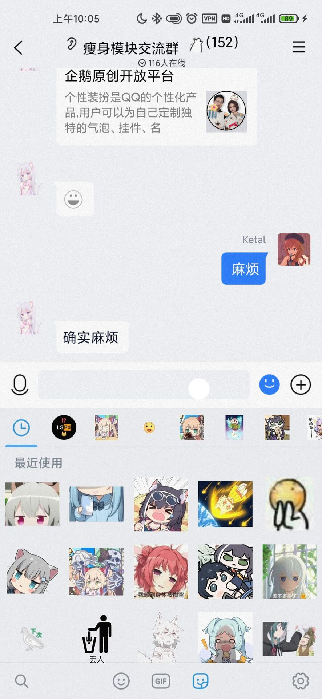

QEmoji是一个旨在提升QQ表情功能的模块

## QEmoji

#### 注:本模块完全免费且开源，一切开发旨在学习，请勿用于非法用途。

### 使用方法

1.勾上模块

2.重启QQ/TIM/微信

3.设置->关于->QQ/TIM/微信瘦身

### 注意

使用本模块需要~~科学上网~~以及登陆[Telegram](https://telegram.org/)账号

### Credit

[AppCenter](https://github.com/microsoft/appcenter-sdk-android)
[QNotified](https://github.com/ferredoxin/QNotified/tree/master)
[XposedBridge](https://github.com/rovo89/XposedBridge)
[QQCleaner](https://github.com/KyuubiRan/QQCleaner)

### 预览效果

